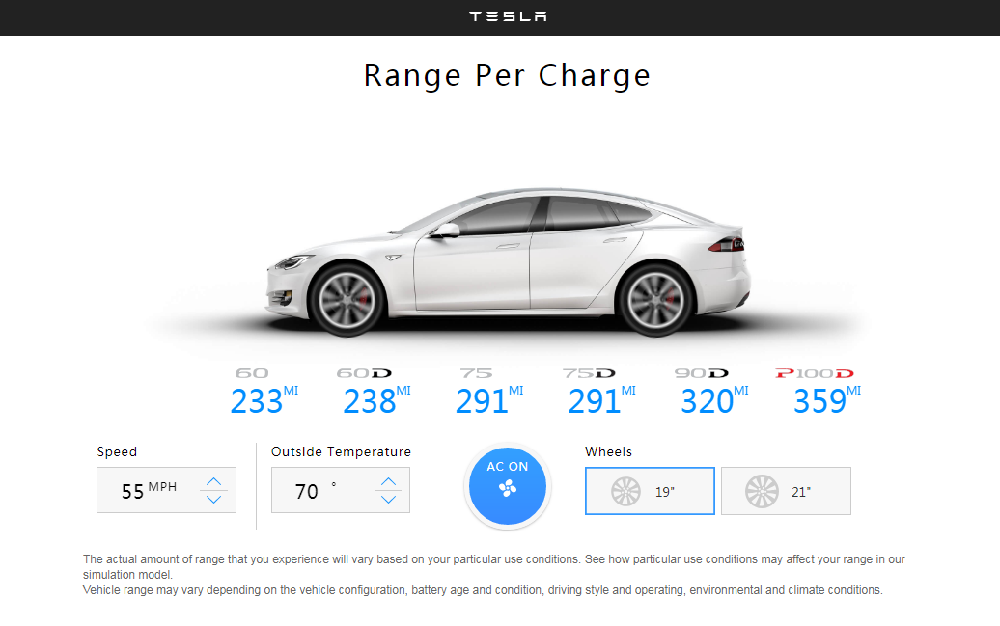

<p align="center">
    <h3 align="center">Tesla Range Calculator Single Page<br></h3>
</p>

## Screenshots


*Need to compile before running and npm install to install the dependencies
*(IT training course practice) Rebuild and implement part functions from https://toddmotto.com/angular-tesla-range-calculator/

### What were using

* React 16
* Webpack 3
* CSS3
* Babel
* HTML5

### Features

* Simple implementation of a car maximum driving ranges with a variety of setting.
* The setting could impact on the range of miles include speed, temperature,fan and wheels size.
* The ranges of miles vary in different models.

### To run

* Clone the project


* Install the dependencies by:

```
npm install
```

* Run development server by:

```
npm run server
```

Open the web browser to `http://localhost:8085/`

* It takes some time for webpack to compile the project


